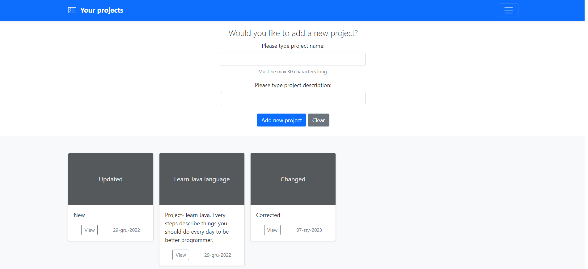

[Angielski](README.MD) - [<ins>Polski</ins>](README.PL.MD)

[![Contributors][contributors-shield]][contributors-url]
[![Stargazers][stars-shield]][stars-url]
[![LinkedIn][linkedin-shield]][linkedin-url]

# 📝Aplikacja do Zarządzania Pracą
Program do zarządzania pracą nad projektami. Umożliwia łatwe osiągniecie celów, dzięki rozpisaniu i zarządzaniu pracą w projekcie.

Zarządzanie zadaniami, podzadaniami w określonym czasie ułatwi Ci osiągnąć cel i ukończyć projekt!

## 📖 Spis treści
* [Informacje ogólne](#informacje-ogólne)
* [Zastosowane technologie](#zastosowane-technologie)
* [Zrzuty ekranu](#zrzuty-ekranu)
* [Wymagane aplikacje/narzędzia](#wymagane-aplikacje-narzedzia)
* [Ustawienia](#ustawienia)
* [Autorzy](#autorzy)

## 📑 Informacje ogólne

Work Management to aplikacja webowa do zarządzania pracą nad projektami. Aplikacja umożliwia tworzenie projektów, dodawanie zadań, przypisywanie ich do użytkowników, a także śledzenie postępu pracy nad projektem.

Celem projektu jest stworzenie prostej i intuicyjnej aplikacji webowej, która pomoże w zarządzaniu pracą nad projektami oraz ułatwi komunikację między użytkownikami.

Projekt jest w fazie rozwoju. Aktualnie zaimplementowane funkcjonalności to tworzenie projektów, dodawanie zadań. Obecnie pracuje nad dodaniem kolejnych funkcjonalności, takich jak przypisywanie zadań do użytkowników, powiadomienia o zmianach w zadaniach oraz udostępnienie aplikacji na serwerze produkcyjnym.

Projekt został napisany w języku Java z wykorzystaniem frameworka Spring Boot 2 oraz narzędzia Maven. Aplikacja korzysta z bazy danych PostgreSQL, a do interfejsu użytkownika wykorzystujemy bibliotekę Thymeleaf.

## Zastosowane technologie
### ⛓️ Development
- [Java 18](https://openjdk.org/projects/jdk/18/)
- [Spring Boot 2](https://spring.io/projects/spring-boot)
- [Spring Data](https://spring.io/projects/spring-data)
- [PostgreSQL (docker)](https://www.postgresql.org/)
- [Maven 3.x](https://maven.apache.org/)
- [Git](https://git-scm.com/)

### 🩺 Testy
- [JUnit5](https://junit.org/junit5/)
- [Mockito](https://site.mockito.org/)

## 👉 Zrzuty ekranu

## 🧰 Wymagane aplikacje/narzędzia
Do uruchomienia aplikacji wymagana jest instalacja następujących narzędzi:

- [IntelliJ IDEA](https://www.jetbrains.com/idea/),
- [Java 18](https://openjdk.org/projects/jdk/18/)
- [Maven 3.x](https://maven.apache.org/download.cgi),
- [Docker](https://docs.docker.com/get-docker/)

## ⚙️ Ustawienia

Aby rozpocząć należy sklonować repozytorium lokalnie:

- git clone: https://github.com/RobertoJavaDev/work-management.git

W celu uruchomienia aplikacji z profilu:

- produkcyjnego

        Przed uruchomiemiem aplikacji należy skonfigurować bazę danych oraz serwer w kilku krokach:

        Stworzyć połączenie bazy danych z dokerem poprzez wpisanie komendy:

        docker run --name workmanagement -e POSTGRES_PASSWORD=password -d -p 5432:5432 postgres

        Połączenie z serwerem:

        Login: postgres

        Hasło: password

- developerskiego

        Należy uruchomić aplikację.

## Autorzy
💻 Autorem aplikacji jest RobertoJavaDev:
- ✉️ robertojavadev@gmail.com
-  [![LinkedIn][linkedin-shield]][linkedin-url]

[contributors-shield]: https://img.shields.io/github/contributors/RobertoJavaDev/work-management.svg?style=for-the-badge
[contributors-url]: https://github.com/RobertoJavaDev/work-management/graphs/contributors
[stars-shield]: https://img.shields.io/github/stars/RobertoJavaDev/work-management.svg?style=for-the-badge
[stars-url]: https://github.com/RobertoJavaDev/work-management/stargazers
[linkedin-shield]: https://img.shields.io/badge/-LinkedIn-black.svg?style=for-the-badge&logo=linkedin&colorB=555
[linkedin-url]: https://www.linkedin.com/in/robert-r-35888825a/